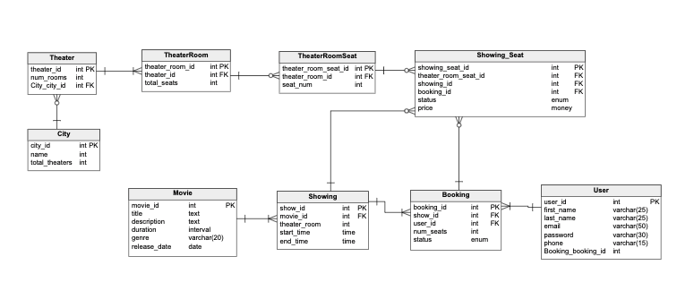

# System Design 
         
System Design questions tests the candidate ability to be able to create a system based on a user prompt. A user prompt is either a client telling you what they want or a team making an assumption of what a potential user might want in an idea. What makes this different from an OOP Design question is that this focuses less on the application components themselves and more of the flow of data and how we scale that data based on our understanding of the various trade offs as we modify our system. For the purposes of the REACTO, we will focus mostly on schema design and API design for the main chunk. We can leave a small discussion at the end for scalability but that will be discussed mostly on Friday for our think, pair, share exercise.
 
## Design Fandango
 
User prompt: I want to be able to book movie theater seats online.

## Strategy Guide

### Talk Through MVP

The goal here is to facilitate a conversation as if this was the pre-app era and we believe a movie ticket booking system is going to be an awesome app. Start out the with question, "What does an MVP movie booking service look like?"

This conversation can go multiple ways. Keep the talk lean (remember: Lean Startup). It's easy for a candidate to get lost in the weeds or get overwhelmed with such an abstract question. If the candidate has trouble thinking about how the MVP might work, throw them a bone from the list below. If the candidate goes outside the bounds of below list, then kindly tell them to table that feature until later for further discussion.

#### MVP

- List cities where movies are located based on affiliate movie theaters
- Once city is selected, our system should display all the movies in that city
- Once movie is selected, show the available show times
- The user can then choose a showing at an affiliate movie theater and book their ticket
- It should then pop up a screen to show seating arrangements that are available or not the ability to select multiple available seats

#### Sample User Story

Once they get the MVP, have them walk through one user story from that MVP. Have them cosplay as if they are actually using the app to go to a movie tonight.

1. User searches for movie
2. User selects movie
3. User is shown available showings of the movie
4. User select specific show timing
5. User selects number of seats to reserve
6. User pays for seats
7. User enjoys movie

### Sample API Design

The MVP and user story set us up for API design. We already know that when we use something like Fandango, most interactions go through some API to fetch some sort of data. Start a discussion (and have them write down) on what kinds of APIs would our system need? They can be public facing or internal; that shouldn't matter. It is important to keep staying lean and base the API design on the MVP. The two most important ones are the search movies API and the reserve seats API.

If the candidate has trouble coming up with the APIs, have them go through their user story carefully and ask them what seems important to be returned to the user.

#### Search Movies API

The amount of parameters here can be endless so to keep them lean, have them focus on the most important information when trying to search for a movie.

Sample Parameters:

- keyword (string) - filter by keyword
- city (string) - filter by city
- datetime (string) - filter by movie start time
- resultsPerPage (number) - number of results per page

searchMovies(keyword, city, datetime, resultsPerPage)

Other parameters that may pop up but aren't as important:

- sort (If we want to provide that option): the sort order we should return
- movieLength
- zipcode
- coordinate (latitude and longitude)

#### Reserve Seats API

The main parameter they should try to figure out is how to attach a user to a reservation. If they come up with the other parameters but not the session ID, nudge them by asking, "How would be be able to keep track of the users and their possible reservations?"

Sample Parameters:

- sessionID (string) to keep track of a specified user's reservation
- movieID (string) to reserve
- showingID (string) to reserve
- seatsReserved (array)

Depending on the status of the reservation, we can return successful or failed

## Schema

The main relationships we want to focus on are as follows:

1. Each city can have multiple theaters
2. Each theater can have multiple theater rooms
3. Each movie can have many showings
4. Each showing can have many bookings
5. A user can have multiple bookings

Below is a full schema of how this might work.

